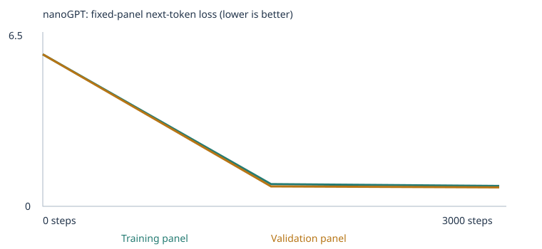
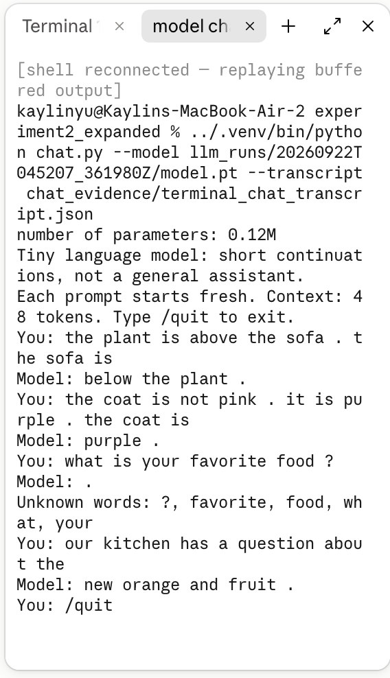

# Class 4 — Custom nanoGPT: starter vs. expanded corpus

Kaylin Yu · From Zero to AI Agents · Fall 2026

This project trains a tiny language model from scratch, using Karpathy's nanoGPT
(the notebook downloads the pinned `model.py` and checks its fingerprint). I train it
twice: first on the classroom corpus only, then on the classroom corpus plus teaching
text I added for two skills. Both runs use the same unchanged 48-case eval suite.
No pretrained weights, no API, no other model.

## What's here

| Item | Experiment 1 (starter) | Experiment 2 (expanded) |
|---|---|---|
| Executed notebook | [custom_llm.ipynb](experiment1_starter/custom_llm.ipynb) | [custom_llm.ipynb](experiment2_expanded/custom_llm.ipynb) |
| Run folder (all evidence) + ZIP | [20260922T043307_884689Z](experiment1_starter/llm_runs/20260922T043307_884689Z/) · [zip](experiment1_starter/llm_runs/20260922T043307_884689Z.zip) | [20260922T045207_361980Z](experiment2_expanded/llm_runs/20260922T045207_361980Z/) · [zip](experiment2_expanded/llm_runs/20260922T045207_361980Z.zip) |
| Loss plot / table | [training_curves.svg](experiment1_starter/llm_runs/20260922T043307_884689Z/training_curves.svg) · [training.csv](experiment1_starter/llm_runs/20260922T043307_884689Z/training.csv) | [training_curves.svg](experiment2_expanded/llm_runs/20260922T045207_361980Z/training_curves.svg) · [training.csv](experiment2_expanded/llm_runs/20260922T045207_361980Z/training.csv) |
| Samples (steps 0 / 1,500 / 3,000) | [samples/](experiment1_starter/llm_runs/20260922T043307_884689Z/samples/) | [samples/](experiment2_expanded/llm_runs/20260922T045207_361980Z/samples/) |
| Inspection (token, embedding, probabilities, gradient, update) | [inspection.json](experiment1_starter/llm_runs/20260922T043307_884689Z/inspection.json) | [inspection.json](experiment2_expanded/llm_runs/20260922T045207_361980Z/inspection.json) |
| Separation evidence | [eval_separation.json](experiment1_starter/llm_runs/20260922T043307_884689Z/eval_separation.json) | [eval_separation.json](experiment2_expanded/llm_runs/20260922T045207_361980Z/eval_separation.json) · [separation_check_report.txt](experiment2_expanded/separation_check_report.txt) |
| Corpus sources | classroom generator (notebook section 3) | same + [corpus/](experiment2_expanded/corpus/) ([how it was made](experiment2_expanded/corpus/README.md)) |
| Model file (model/run identity) | [model.pt](experiment1_starter/llm_runs/20260922T043307_884689Z/model.pt) · fingerprint `bf49f05b14d5…` | [model.pt](experiment2_expanded/llm_runs/20260922T045207_361980Z/model.pt) · fingerprint `ad812bba1d39…` |

## Quick results

Everything below is copied from the saved result files; nothing is estimated.

| Experiment | Stage | Correct / 48 (all cases) | Scorable cases (vocab coverage) | Accuracy on scorable | Model fingerprint | Results |
|---|---|---|---|---|---|---|
| 1 Starter (classroom only) | untrained | 9 (19%) | 24/48 (50%) | 9/24 (38%) | `73fcac5a3daa…` | [untrained](experiment1_starter/llm_runs/20260922T043307_884689Z/language_evals/untrained/) |
| 1 Starter (classroom only) | trained 3,000 steps | **20 (42%)** | 24/48 (50%) | 20/24 (83%) | `bf49f05b14d5…` | [final](experiment1_starter/llm_runs/20260922T043307_884689Z/language_evals/final/) |
| 2 Expanded (+ my corpus/) | untrained | 8 (17%) | 29/48 (60%) | 8/29 (28%) | `f3a0be89b4dc…` | [untrained](experiment2_expanded/llm_runs/20260922T045207_361980Z/language_evals/untrained/) |
| 2 Expanded (+ my corpus/) | trained 3,000 steps | **27 (56%)** | 29/48 (60%) | 27/29 (93%) | `ad812bba1d39…` | [final](experiment2_expanded/llm_runs/20260922T045207_361980Z/language_evals/final/) |

Each results folder contains `eval_results.csv`/`.json` (every case with probabilities and the free
continuation), `eval_summary.json` and `eval_cases.json`. Separation evidence for each run is in its
`eval_separation.json` and `corpus_manifest.json`.

**Scores by group and category (trained models; correct / scorable / total):**

| Group / category | Exp 1 trained | Exp 2 trained |
|---|---|---|
| starter_patterns: domain_context | 8/8/8 | 8/8/8 |
| starter_patterns: domain_place | 8/8/8 | 8/8/8 |
| starter_transfer: new_wording | 4/8/8 | 8/8/8 |
| extend: **negation** (my skill) | 0/0/3 | **0/2/3** |
| extend: **spatial_relations** (my skill) | 0/0/3 | **3/3/3** |
| extend: grammar, opposites, reference, sequence, everyday_knowledge, categories_and_analogies | 0/0/3 each | 0/0/3 each |

## Setup and choices

| Setting | Value | Why |
|---|---|---|
| Model | nanoGPT, 2 layers, 4 attention heads, 64-number embeddings, 48-token context | fixed by the notebook |
| Parameters | 111,872 (Exp 1, 136-word vocab) · 127,616 (Exp 2, 382-word vocab) | the embedding table grows with the vocabulary |
| Training steps | 3,000 | the notebook's recommended main experiment |
| Learning rate | 0.001 (100-step warmup, cosine decay to 10%) | recommended default |
| Batch | 32 passages per step, seed 42 | fixed by the notebook |
| Hardware | MacBook Air CPU, PyTorch 2.14.0; ~7–9 s of training per run | |

I kept steps and learning rate **identical** in both experiments, so the only difference is the text.
My predictions were written into each notebook **before** training (section "My prediction").

## Experiment 1 — starter corpus

- **Loss** (fixed panels, lower = better): training 4.926 → 0.682 → 0.678, validation 4.928 → 0.718 → 0.706 at steps 0 / 1,500 / 3,000.
  A random guess over 136 words would give about 4.9, so the model started at chance and learned a lot. Most of the
  learning happened in the first half, and validation sentences use the same templates as training, so the low loss mostly means "learned the templates."
  Chart: [training_curves.svg](experiment1_starter/llm_runs/20260922T043307_884689Z/training_curves.svg).
- **Samples before training:** random words (`pear professor bond doctor course harvest …`).
  **After:** `the report about the nurse explains the health in detail .` Template-like, as I predicted.
- **Evals:** starter patterns 6/16 → 16/16; new wording 3/8 → 4/8; extend-corpus 0/24 before and after, because **all 24 were
  unscorable**. Every one contains words the model has never seen (e.g. `not`, `above`, `she`, `hot`). My prediction that the extend cases would
  "improve a lot" was **wrong**: more training can't teach words that are not in the vocabulary.

## Experiment 2 — extension categories and new teaching data

**Categories chosen: negation and spatial relations.** In both, the answer is stated inside the prompt
("X is not A. it is B. X is ___"; "A is above B. B is ___"), so I could teach the *pattern* with completely
different examples without handing over any test answer. I did not pick opposites, everyday knowledge, or categories.
In those, the answer is a fact ("water freezes into ice"), and teaching that fact would amount to training on the answer key.

**Added data** ([experiment2_expanded/corpus/](experiment2_expanded/corpus/), 907 new unique passages, 297 word types):

| File | Passages | What it is |
|---|---|---|
| `negation_generated.txt` | 420 | e.g. `the chair is not gold.it is brown.the chair is brown.` / `ben did not buy rice…` style with other names, foods, colours, states |
| `spatial_generated.txt` | 420 | above↔below, left↔right, inside↔contains, beside, in several phrasings |
| `negation_handwritten.md` | 25 | more natural wording ("the pond is not deep. it is shallow.") |
| `spatial_handwritten.md` | 20 | "the clock hangs above the sofa", "the cat sleeps below the table" |
| `neutral_vocabulary.txt` | 23 | plain sentences that put test words (box, lamp, desk, colours, tea…) into the vocabulary without stating any tested relationship |

Generated by [`corpus_tools/make_extension_corpus.py`](corpus_tools/make_extension_corpus.py) (fixed seed, reproducible).

**How I kept tests out of training** (checked by [`corpus_tools/check_separation.py`](corpus_tools/check_separation.py), which passes):
- The notebook itself removes classroom sentences containing a test prompt (160 removed) and rejects imported files that contain one.
- My teaching examples never use a test's subject, objects, names, or **any** answer choice (e.g. negation examples use no red/blue/green/yellow/open/closed/tea/milk/rice/bread; spatial examples use no book/bag/lamp/desk/ball/box/shelf).
- No passage contains a test's last 4 prompt words followed by its answer. (A 3-word version of that check flagged the generic phrase "is to the right", which every left/right example needs. I switched to 4 words, which includes the test's own object, e.g. "box is to the right".)
- The longest run of words any passage shares with any test prompt is **4**, e.g. "is left of the".
- The vocabulary is built by the notebook from training passages only; the eval file is never read for training or vocabulary.
- **Formatting choice:** the notebook splits passages at "period + space", which would cut a multi-sentence example in half. I wrote internal periods without a space (`green.it is`) so each example stays one passage. The tokens are identical.

**Results:**
- **Loss:** training 5.953 → 0.869 → 0.798; validation 5.954 → 0.781 → 0.743. The numbers start higher than Exp 1 because a
  382-word vocabulary makes random guessing harder (≈ ln 382 ≈ 5.95), so the loss is **not directly comparable** between experiments.
- **Spatial relations: 0/0 → 3/3.** And it's confident: for the above/below case it gives `below` 41% vs `above` 0.04%; for left/right it gives
  `right` 97%. The free continuation for the left/right case was literally `right of the course .`
- **Negation: 0/2 scorable correct.** Worse than the lucky untrained model (1/2). In both scored cases the model picked the **rejected** word
  (`red`, `tea`), with every choice under 1% probability. It never learned to copy the stated colour/item into a slot it had not seen those words in.
- **`closed` was unknown**, so one negation case was unscorable. My only sentence with `closed` landed in the random 10% validation split, and the vocabulary comes from training text only.
- **Starter patterns stayed 16/16**, as I predicted.

### Is it real or luck? Supplementary seed check

The whole run depends on one random seed (starting weights *and* which passages are held out). I reran both notebooks
unchanged except for the seed (1, 2, 3). These are **extra** runs, not replacements for the four required result sets. Only their summary is included here; the six run folders (26 MB) were kept locally and left out of this repository.

| Run | All /48 | Scorable | New wording /8 | Negation (correct/scorable) | Spatial (correct/scorable) |
|---|---|---|---|---|---|
| Exp 1 seed 42 (main) | 20 | 24 | 4 | – | – |
| Exp 1 seeds 1/2/3 | 22 / 23 / 23 | 24 | 6 / 7 / 7 | – | – |
| Exp 2 seed 42 (main) | 27 | 29 | 8 | 0/2 | 3/3 |
| Exp 2 seeds 1/2/3 | 23 / 27 / 25 | 26 / 29 / 27 | 6 / 8 / 8 | 0/1, 1/2, 0/2 | 1/1, 2/3, 1/1 |

- The **new-wording jump 4 → 8 is mostly luck**: seed 42 was a low draw for Exp 1. The averages (6.0 vs 7.5) are too close and too noisy to credit to my corpus.
- **Spatial learning is consistent:** 7/8 correct whenever a spatial case was scorable.
- **Negation failed consistently:** 1/7 across all seeds.
- **Coverage varies (26–29)** because each test word appears in only one neutral sentence; if that sentence is held out, the word becomes unknown.

## What changed: vocabulary coverage vs. learned patterns

- **Coverage:** Exp 2 raised scorable cases from 24 to 29, and that's the only reason my two categories could score at all.
  18 other extend cases stay unscorable because I did not target them.
- **Learned pattern:** spatial improved beyond coverage. The model moved from chance to high-confidence correct answers on objects that never appeared in any spatial teaching example.
- **Coverage without pattern:** negation became scorable but not correct.

## Three different measurements

- **Four-choice score:** which of 4 given words the model rates most likely. Multiple choice; the model writes nothing.
- **Free continuation:** what the model writes on its own. Exp 1 example: for `the report about the mortgage explains the` it *picked* `payment` (correct) but *wrote* `return in detail .`
  A correct choice ≠ fluent text.
- **Vocabulary coverage:** whether the test can be attempted at all. Unknown words = automatic 0, not a guess.

## Loss and samples (fixed evaluation panels of 20 passages each)

| Step | Exp 1 training loss | Exp 1 validation loss | Exp 2 training loss | Exp 2 validation loss |
|---|---|---|---|---|
| 0 (untrained) | 4.926 | 4.928 | 5.953 | 5.954 |
| 1,500 (halfway) | 0.682 | 0.718 | 0.869 | 0.781 |
| 3,000 (final) | 0.678 | 0.706 | 0.798 | 0.743 |

| Experiment 1 | Experiment 2 |
|---|---|
|  |  |

Samples use the same settings at every stage (temperature 0.8, sampling seed 2026, up to 32 tokens). First two of four shown; all four are in `samples/`.

| Stage | Experiment 1 | Experiment 2 |
|---|---|---|
| Untrained | `pear professor bond doctor course harvest team physician journey …` / `kitchen purchase journey product question discussion journey service . nurse local` | `our too <BOS> payment about door investment sink bed plate max wrote …` / `tickets so question sink taste tutor gray draft busy called lesson …` |
| Halfway | `our school has a question about the new educator and lesson .` / `a review of risk helped us understand the different deposit .` | `our market has a question about the important brand and quality .` / `we learned about the important platform during a discussion of data .` |
| Final | `our school has a question about the new educator and lesson .` / `the report about the nurse explains the health in detail .` | `our market has a question about the important brand and quality .` / `the report about the shopper explains the service in detail .` |

Samples are already fluent-looking by the halfway point and barely change after it, which matches the flat loss.
**Notable:** none of Experiment 2's free samples produce a negation or spatial sentence. With ~4,600 classroom passages vs ~900 of mine,
the model's "default" text is still classroom templates. It uses the new patterns only when a prompt steers it there.

### Temperature comparison (after training)

Temperature controls how adventurous the sampling is: low = always pick the likeliest word, high = take more chances.

| Temperature | Experiment 2 sample 3 | Experiment 2 sample 4 |
|---|---|---|
| 0.3 | `the team discussed the shopper and the service at the store .` | `the different tutor was mentioned in the learning report yesterday .` |
| 0.8 | `the report about the shopper explains the service in detail .` | `a review of return helped us understand the local bond .` |
| 1.2 | `the customer recommended the merchandise after checking the price .` | `we learned about the new banana during a discussion of juice .` |

In Experiment 1, 0.8 and 1.2 gave identical samples: the model was so confident that even adventurous sampling picked the same words.
Experiment 2 varied more at 1.2 but stayed inside the templates. Full lists: `temperature_comparison.json` in each run folder.

## Inspections (kept from the notebook)

- **Probe word `customer`:** ID 28 (Exp 1). All 64 numbers are printed before and after in section 5/8 of each notebook and saved in `inspection.json`.
- **Nearest words by embedding** ([`corpus_tools/embedding_neighbors.py`](corpus_tools/embedding_neighbors.py)): before training `customer` was near random words (bus, educator, helped; similarity ~0.2).
  After: shopper, client, buyer, subscriber, consumer (0.97–0.98), as I predicted. In Exp 2, `above` ended near beside, left, below, inside, right. Opposites end up close because they fill the same slots.
- **Next-word probabilities after "the customer":** before ≈ flat (top word 1.6%); after: reviewed 18%, recommended 17%, ordered 17%, selected 16%, compared 16% (Exp 1).
- **First weight update** (Exp 1, `customer`, coordinate 0): before −0.057592, gradient +0.000693, learning rate 0.00001 (warmup), after −0.057602.
  The weight moved by about −0.00001, i.e. one learning-rate step opposite the gradient's sign. That's AdamW's first step, not simply rate × gradient.

## In my own words

*These explanations were drafted with help from my AI assistant, using my run's actual numbers, and reviewed by me.*

1. **Tokens.** A token is one piece of text the model reads: here, a whole word or a punctuation mark. Before training, the notebook lists every word in the training text and gives each one a number, like seat numbers in a theater. "customer" got number 28 in my starter run. The number is just a label and says nothing about meaning; the list is in alphabetical order. Words that aren't on the list become "unknown". That's why the model couldn't attempt any of the 24 extension tests in Experiment 1.

2. **Embeddings.** Each word number points to a row of 64 numbers, which is the model's internal description of that word. The starter model's table had 136 rows (one per word) of 64 numbers each. At first the numbers are random and small (around ±0.05), so "customer" was closest to unrelated words like bus and educator. During training they get adjusted. Afterwards, customer's closest words were shopper, client, buyer, subscriber and consumer, with a similarity of 0.97–0.98 out of a possible 1.0. That happened because those words always appeared in the same places in the classroom sentences, not because the model knows what a customer is. The same effect put "above" next to "below": opposites fill the same spots in a sentence.

3. **Probabilities.** For every next word, the model gives a percentage chance to every word it knows, and the percentages add up to 100%. After "the customer", the untrained model spread its guesses almost evenly (its top choice got only 1.6%). The trained model put about 17% each on reviewed, recommended, ordered, selected and compared, which are exactly the verbs that follow "the customer" in the classroom sentences. When it writes text, it picks the next word at random but weighted by these percentages. "Temperature" controls how much it favors the top choices.

4. **Loss and gradients.** Loss is the score for how surprised the model was by the real next word: low when it gave that word a high percentage, high when it didn't. My starter model began at 4.93, about what you'd get by guessing blindly among 136 words, and ended at 0.71. A gradient tells the model, for each of its numbers, which direction to nudge it to lower the loss, and how strongly that number affects it. On the very first step, the gradient for one of customer's 64 numbers was +0.0007. That meant raising this number would slightly increase the error, so it should go down.

5. **Weight changes.** The optimizer (the part that does the nudging, called AdamW) then moved that number from −0.057592 to −0.057602, a tiny step downward, opposite to the gradient. It was tiny because training starts gently: on step 1 the learning rate was only 0.00001, 1% of my chosen 0.001, and it ramped up over the first 100 steps. The step wasn't exactly "learning rate × gradient", because AdamW adjusts step sizes using its own running averages. Repeated over 3,000 steps and about 112,000 numbers, these tiny nudges are what turned random words into template sentences.

## Chat interface

Launch (terminal, from `experiment2_expanded/`):

```bash
../.venv/bin/python chat.py --model llm_runs/20260922T045207_361980Z/model.pt --transcript chat_evidence/my_chat.json
```

Each prompt starts fresh; the model only continues text, and it is not an assistant.

**Model used:** Experiment 2 trained model, `experiment2_expanded/llm_runs/20260922T045207_361980Z/model.pt`,
fingerprint `ad812bba1d39ceab…` (3,000 steps, temperature 0.8, max 24 tokens). The transcript records the same fingerprint.

Evidence: [terminal_chat_transcript.json](experiment2_expanded/chat_evidence/terminal_chat_transcript.json) ·
screenshot below. (Each notebook's section 10 also ran one notebook chat turn, "the customer", saved as `chat_transcript.json` in its run folder.)



| # | My prompt | Model's actual reply | What it shows |
|---|---|---|---|
| 1 | `the plant is above the sofa . the sofa is` | `below the plant .` | ✅ Spatial flip works on a combination that is **not** in the training text. |
| 2 | `the coat is not pink . it is purple . the coat is` | `purple .` | ✅ Negation works here, even though it failed the tests. This exact sentence is also not in the training text. |
| 3 | `what is your favorite food ?` | `.` | ❌ All five words (including `?`) are unknown, so it has nothing to work with. It's not an assistant and can't answer questions. |
| 4 | `our kitchen has a question about the` | `new orange and fruit .` | Template recall: training contains `our kitchen has a question about the new orange and juice .` and similar lines. |

**What the chat adds to the eval story.** Negation succeeded in chat (#2) but failed on the tests. The difference: pink and purple
appear in my negation teaching examples, while the test colours (red, blue) were deliberately kept out of them. So the model seems to have learned
"repeat the stated word" only for words it has practised in that slot, not as a general rule. That supports failure #1 below.
Caveat: I tried each prompt once, at temperature 0.8, so this is 4 examples, not a measurement.

## Failures and limitations

1. **Negation did not work on the tests** (1/7 scorable across 4 seeds). Likely cause: my strict separation rule kept all test colours/items out of negation examples, and a 2-layer model did not learn a general "copy the stated word" rule for words it had never seen in that slot. The chat supports this: with practised colours (pink/purple) it answered correctly.
2. **Fragile vocabulary:** single-sentence vocabulary words can be randomly held out (`closed` in the main run).
3. **The benchmark is public and I read it** to choose categories, so this is a development benchmark, not an unseen test.
4. **The new skills don't show up in free text:** Exp 2's unprompted samples are all classroom templates.
5. **Templates, not understanding:** validation passages share templates with training; low loss and fluent-looking samples don't show general language ability.
6. **One seed per required experiment:** differences of a few cases can be noise (see seed check).

**Next experiment:** repeat each neutral vocabulary word in 3–5 different sentences (fixes coverage), and add negation examples that vary *which* word is rejected vs. stated over a larger set of colours/items, then compare over several seeds.

## Reproduce

```bash
python3 -m venv .venv && .venv/bin/pip install torch "pypdf>=5,<7" nbconvert nbclient ipykernel
.venv/bin/python corpus_tools/make_extension_corpus.py      # regenerate teaching text
.venv/bin/python corpus_tools/check_separation.py           # separation check
cd experiment2_expanded && ../.venv/bin/jupyter nbconvert --to notebook --execute --inplace custom_llm.ipynb
```

Rerun evals on a saved model: `python run_evals.py --model llm_runs/<run>/model.pt --output <empty folder>`.
Verified: rerunning on the saved Exp 2 `model.pt` reproduced 27/48, 29 scorable ([experiment2_expanded/rerun_evals_check/](experiment2_expanded/rerun_evals_check/)).

Credits: nanoGPT `model.py` © Andrej Karpathy, MIT license ([NANOGPT_LICENSE](NANOGPT_LICENSE)), pinned commit `3adf61e`. Notebook, eval suite and chat/eval scripts: course starter ([pepealonso95/custom-llm](https://github.com/pepealonso95/custom-llm)).

AI assistance: Claude (Claude Code) helped set up, ran the notebooks, wrote the corpus generator/checker, drafted this README, and drafted the "In my own words" explanations, which I reviewed. All numbers come from the saved runs.
